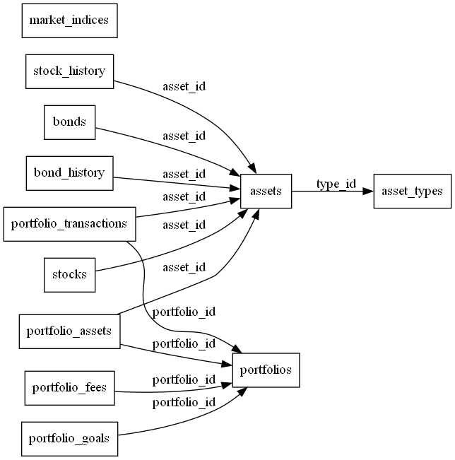

# stabledb

## Introduction

stabledb is a comprehensive database project designed to manage and analyze financial data for individual and institutional clients. The main goal of this project is to provide a robust and flexible solution for tracking and updating various financial assets, including stocks, bonds, and cash, as well as portfolio transactions. By leveraging the power of SQL and Python, stabledb streamlines the data extraction, transformation, and loading processes, resulting in an efficient and user-friendly system for managing financial data.

The project aims to address the challenges faced by investors and financial professionals in keeping track of their assets and transactions, ensuring data accuracy, and staying up-to-date with the latest market information. By centralizing all relevant financial data in one cohesive database, stabledb enables users to make more informed investment decisions and optimize their portfolio performance.

## System Requirements

To successfully run and utilize stabledb, the following software requirements must be met:

### Operating System
- Compatible with Windows, macOS, and Linux operating systems.

### Programming Language
- Python 3.6 or higher (https://www.python.org/downloads/).

### Python Libraries
- Pandas (https://pandas.pydata.org/)
- SQLite3 (https://docs.python.org/3/library/sqlite3.html) - Included in Python standard library
- MetaTrader5 (https://www.mql5.com/en/docs/integration/python_metatrader5)

### Database
- SQLite (https://sqlite.org/index.html)

### Development Environment
- Visual Studio Code (https://code.visualstudio.com/) or any other preferred code editor/IDE that supports Python development.

### Version Control (Optional)
- Git (https://git-scm.com/) for version control and collaboration.

Please ensure that all the required software components are installed and configured correctly before proceeding with the setup and usage of stabledb.

## Database Schema

The stabledb database consists of several tables that store information about portfolios, assets, asset types, portfolio assets, stocks, bonds, portfolio transactions, portfolio fees, portfolio goals, and market indices. 

It includes tables for storing information about portfolios, assets, 
asset types, portfolio assets, stocks, bonds, portfolio transactions, 
portfolio fees, portfolio goals, and market indices. The stock_history 
and bond_history tables include columns for storing historical data for 
stocks and bonds, and the portfolio_transactions table allows you to store 
information about the buy and sell transactions that occur in each portfolio. 
The portfolio_fees table allows you to store information about the fees and 
expenses associated with each portfolio, and the portfolio_goals table 
allows you to store information about the financial goals and constraints 
for each portfolio. The market_indices table allows you to store information  
about the market indices that you want to use as benchmarks for your 
portfolio performance.

The following section describes each table and its columns.



### 1. `asset_types` table

| Column Name | Data Type | Description                                     |
|-------------|-----------|-------------------------------------------------|
| id          | INTEGER   | Unique identifier for each asset type.          |
| name        | TEXT      | The name of the asset type (e.g., Stock, Bond). |

### 2. `assets` table

| Column Name | Data Type | Description                                               |
|-------------|-----------|-----------------------------------------------------------|
| id          | INTEGER   | Unique identifier for each asset.                         |
| name        | TEXT      | The name of the asset (e.g., Apple Inc.).                 |
| type_id     | INTEGER   | Foreign key referencing the asset type in `asset_types`. |

### 3. `portfolios` table

| Column Name  | Data Type | Description                        |
|--------------|-----------|------------------------------------|
| id           | INTEGER   | Unique identifier for each portfolio. |
| name         | TEXT      | The name of the portfolio.         |
| date_created | TEXT      | The date the portfolio was created or modified (YYYY-MM-DD). |
| description  | TEXT      | Optional description of the portfolio. |

### 4. `portfolio_assets` table

| Column Name    | Data Type | Description                                                |
|----------------|-----------|------------------------------------------------------------|
| id             | INTEGER   | Unique identifier for each portfolio asset.                |
| portfolio_id   | INTEGER   | Foreign key referencing the portfolio in `portfolios`.     |
| asset_id       | INTEGER   | Foreign key referencing the asset in `assets`.             |
| asset_quantity | REAL      | The quantity of the asset in the portfolio.                |
| last_modified  | TEXT      | The date of the last asset transaction (YYYY-MM-DD).       |

### 5. `stocks` table

| Column Name | Data Type | Description                                         |
|-------------|-----------|-----------------------------------------------------|
| asset_id    | INTEGER   | Primary key, foreign key referencing `assets.id`.   |
| ticker      | TEXT      | Unique stock ticker symbol.                         |
| exchange    | TEXT      | The stock exchange the stock is traded on.          |
| type        | TEXT      | The type of stock (e.g., common, preferred).        |
| sector      | TEXT      | The sector the stock belongs to.                    |
| subsector   | TEXT      | The subsector the stock ongs.                       |
| segment     | TEXT      | The segment the stock belongs to.                   |


### 6. `stock_history` table

| Column Name    | Data Type | Description                                                |
|----------------|-----------|------------------------------------------------------------|
| asset_id       | INTEGER   | Foreign key referencing the asset in `assets`.             |
| date           | TEXT      | The date of the historical data (YYYY-MM-DD).              |
| open           | REAL      | The opening price of the stock on the given date.          |
| high           | REAL      | The highest price of the stock on the given date.          |
| low            | REAL      | The lowest price of the stock on the given date.           |
| close          | REAL      | The closing price of the stock on the given date.          |
| adjusted_close | REAL      | The adjusted closing price of the stock on the given date. |
| volume         | REAL      | The trading volume of the stock on the given date.         |

### 7. `bonds` table

| Column Name  | Data Type | Description                                         |
|--------------|-----------|-----------------------------------------------------|
| asset_id     | INTEGER   | Primary key, foreign key referencing `assets.id`.   |
| issuer       | TEXT      | The issuer of the bond.                             |
| type         | TEXT      | The type of bond (e.g., corporate, government).     |
| rating       | TEXT      | The credit rating of the bond.                      |
| coupon_type  | TEXT      | The type of bond coupon (e.g., fixed, floating).    |

### 8. `bond_history` table

| Column Name   | Data Type | Description                                                |
|---------------|-----------|------------------------------------------------------------|
| asset_id      | INTEGER   | Foreign key referencing the asset in `assets`.             |
| date          | TEXT      | The date of the historical data (YYYY-MM-DD).              |
| coupon        | REAL      | The coupon rate of the bond on the given date.             |
| maturity      | TEXT      | The maturity date of the bond.                             |
| yield         | REAL      | The yield of the bond on the given date.                   |
| spread        | REAL      | The spread of the bond on the given date.                  |
| credit_rating | TEXT      | The credit rating of the bond on the given date.           |

### 9. `portfolio_transactions` table

| Column Name  | Data Type | Description                                          |
|--------------|-----------|------------------------------------------------------|
| id           | INTEGER   | Unique identifier for each transaction.              |
| portfolio_id | INTEGER   | Foreign key referencing the portfolio in `portfolios`.|
| asset_id     | INTEGER   | Foreign key referencing the asset in `assets`.       |
| type         | TEXT      | The transaction type (either "buy" or "sell").       |
| date         | TEXT      | The date of the transaction (YYYY-MM-DD).            |
| quantity     | REAL      | The quantity of the asset involved in the transaction.|
| price        | REAL      | The price of the asset at the time of the transaction.|
| description  | TEXT      | Optional description of the transaction.             |

### 10. `portfolio_fees` table

| Column Name | Data Type | Description                                            |
|-------------|-----------|--------------------------------------------------------|
| id          | INTEGER   | Unique identifier for each fee record.                 |
| portfolio_id| INTEGER   | Foreign key referencing the portfolio in `portfolios`. |
| fee_type    | TEXT      | The type of fee (e.g., management fee, transaction fee).|
| fee_amount  | REAL      | The amount of the fee.                                 |
| fee_date    | TEXT      | The date the fee was charged (YYYY-MM-DD).             |

### 11. `portfolio_goals` table

| Column Name     | Data Type | Description                                            |
|-----------------|-----------|--------------------------------------------------------|
| id              | INTEGER   | Unique identifier for each goal record.                |
| portfolio_id    | INTEGER   | Foreign key referencing the portfolio in `portfolios`. |
| goal_type       | TEXT      | The type of goal (e.g., return, risk).                 |
| goal_value      | REAL      | The value of the goal (e.g., target return percentage).|
| goal_description| TEXT      | Optional description of the goal.                      |

### 12. `market_indices` table

| Column Name | Data Type | Description                                  |
|-------------|-----------|----------------------------------------------|
| id          | INTEGER   | Unique identifier for each market index.     |
| name        | TEXT      | The name of the market index.                |
| description | TEXT      | Optional description of the market index.    |

## ETL Process

The ETL (Extract, Transform, Load) process for the stabledb database involves extracting data from various data sources, transforming and cleaning the data, and finally loading the data into the database. This section will provide an overview of the data sources, extraction methods, data transformation and cleaning steps, and data loading methods and update frequency.

### Data Sources

The primary data sources for the stabledb database include:

1. **MetaTrader5**: This platform provides historical stock and bond data, as well as market index data.
2. **Yahoo Finance**: This source is used as a fallback or supplementary source for financial data when the primary data source is unavailable or insufficient.

### Data Extraction Methods

Data extraction from these sources is performed using the following methods:

1. **MetaTrader5 API**: The MetaTrader5 API is used to access historical stock and bond data, as well as market index data. Python scripts are written to interact with the API and retrieve the required data.
2. **Yahoo Finance API**: The Yahoo Finance API is used when MetaTrader5 data is insufficient or unavailable. Similar to the MetaTrader5 API, Python scripts are employed to access the data.

### Data Transformation and Cleaning Steps

The extracted data needs to be transformed and cleaned before being loaded into the stabledb database. The following steps are performed during this stage:

1. **Data Type Conversion**: Some data types, such as dates and timestamps, need to be converted into the appropriate format for the database schema.
2. **Renaming Columns**: Column names may need to be renamed to match the database schema.
3. **Removing Unnecessary Columns**: Any columns not needed in the database schema are removed.
4. **Handling Missing Values**: Missing or null values are handled based on the database schema's requirements and constraints.
5. **Data Validation**: The transformed data is validated to ensure consistency and correctness before loading it into the database.

### Data Loading Methods and Update Frequency

Once the data has been transformed and cleaned, it is loaded into the stabledb database using the following methods:

1. **Python SQLite3 Library**: Python's SQLite3 library is used to interact with the SQLite database, execute SQL commands, and load data into the appropriate tables.
2. **Bulk Inserts**: Data is inserted into the database using bulk insert statements to optimize performance and reduce the time taken to load data.

The update frequency for the database depends on the specific requirements of the project. However, it is generally recommended to update the data at regular intervals to ensure that the database contains the most recent and accurate information. For example, stock and bond historical data can be updated daily, while other data, such as portfolio transactions and fees, may be updated less frequently, depending on the user's needs and preferences.

## Scripts

This section provides an overview of the scripts used in the stabledb project. The scripts are essential components of the ETL process, data management, and testing.

### stock_history.py

The `stock_history.py` script is responsible for downloading historical stock data and updating the `stock_history` table in the stabledb database. The script performs the following main functions:

1. **download_historical_data**: This function fetches historical stock data from MetaTrader5 or Yahoo Finance, depending on availability. It takes the ticker symbol, timeframe, and date range as input parameters and returns a DataFrame with the historical data.
2. **update_stock_history**: This function updates the `stock_history` table with the historical stock data fetched by the `download_historical_data` function. It takes the start and end dates, asset ID, ticker, and database cursor as input parameters.
3. **check_and_update_history**: This function checks if the `stock_history` table needs updating and, if so, calls the `update_stock_history` function to perform the update. It takes the asset ID, ticker, and database cursor as input parameters.

### test_suite.py

The `test_suite.py` script is used for testing the functionality of the stabledb project. It contains test functions that ensure the correct operation of the ETL process, data management, and other critical components of the system. The main test functions included are:

1. **test_stock_history_update**: This function tests the `update_stock_history` function in the `stock_history.py` script. It checks whether the `stock_history` table is updated correctly by comparing the row count before and after the update.
2. Additional test functions can be added to this script to cover other aspects of the project, such as data validation, portfolio management, and other ETL processes.

### Additional Scripts

Depending on the complexity and specific requirements of the stabledb project, additional scripts may be needed. These scripts can include:

1. **bond_history.py**: A script similar to `stock_history.py` for handling bond historical data and updating the `bond_history` table in the stabledb database.
2. **portfolio_management.py**: A script for managing portfolio assets, transactions, fees, and goals. This script would interact with the corresponding database tables and provide functions for adding, updating, and deleting portfolio information.
3. **market_indices.py**: A script for handling market index data, including downloading historical data and updating the `market_indices` table in the stabledb database.
4. **data_validation.py**: A script for validating the integrity and consistency of the data in the stabledb database. This script could include functions for checking data types, foreign key constraints, and other data validation requirements.

## Testing

A robust testing strategy is essential for ensuring the correctness and integrity of the stabledb database system. The testing process includes multiple levels of tests, including unit tests, integration tests, and test data sources to validate the functionality and performance of the system.

### Unit Tests

Unit tests are designed to test individual functions and components of the system in isolation. These tests help identify issues and bugs in the code at an early stage, making it easier to fix and maintain the system. The `test_suite.py` script includes several unit tests for the key functions in the stabledb project, such as:

- `test_stock_history_update`: This unit test verifies that the `update_stock_history` function in the `stock_history.py` script correctly updates the `stock_history` table.

Additional unit tests can be added to the `test_suite.py` script to cover other critical functions and components of the system, such as data extraction, data transformation, data validation, and portfolio management functions.

### Integration Tests

Integration tests focus on testing the interaction between different components of the system. These tests ensure that the various parts of the system work together correctly and that data flows smoothly from one component to another. Integration tests can be included in the `test_suite.py` script or in separate scripts, depending on the project's organization and requirements.

Some examples of integration tests for the stabledb project include:

- Testing the ETL process as a whole, from data extraction to data loading, ensuring that the entire pipeline works as expected.
- Testing the interaction between the database and the Python scripts, ensuring that database queries and updates are executed correctly.
- Testing the integration between different data sources, such as MetaTrader5 and Yahoo Finance, to ensure that data is fetched and combined correctly.

### Test Data Sources and Sample Data

To effectively test the stabledb system, it is essential to use representative test data sources and sample data. This allows you to validate the system's functionality and performance using real-world data, ensuring that it meets the project's requirements and expectations.

Test data sources can include:

- Historical stock and bond data from MetaTrader5, Yahoo Finance, or other financial data providers.
- Market index data from various sources, such as stock exchanges or financial data providers.
- Sample portfolio data, including assets, transactions, fees, and goals, either generated by the user or obtained from third-party sources.

By using representative test data sources and sample data, you can ensure that the stabledb system is robust, reliable, and ready for deployment in real-world financial management scenarios.

## Usage

This section provides a step-by-step guide on how to use the stabledb project, from setting up the development environment to running the Python scripts and tests.

### Setting Up the Development Environment

1. Ensure that you have Python installed on your system. If not, download and install the latest version of Python from the official website: https://www.python.org/downloads/

2. Clone the stabledb project repository to your local machine or download the project files as a ZIP archive and extract them to a suitable directory.

3. Open the project folder in Visual Studio Code or your preferred code editor.

### Installing Required Software and Libraries

1. Open a terminal or command prompt and navigate to the project directory.

2. Create a virtual environment to isolate the project dependencies:

```{cmd}
python -m venv venv
```

Activate the virtual environment:

- On Windows:

  ```
  venv\Scripts\activate
  ```

- On macOS and Linux:

  ```
  source venv/bin/activate
  ```

3. Install the required libraries by running the following command:

```{cmd}
 pip install -r requirements.txt
```

This command installs the necessary libraries, such as pandas, MetaTrader5, and SQLite3.

### Running the Python Scripts

1. Ensure that the virtual environment is active (see the "Installing Required Software and Libraries" section above).

2. To run the `stock_history.py` script, open a terminal or command prompt and navigate to the project directory. Then, run the following command:

```{cmd}
 python stock_history.py
```


This command executes the script and updates the `stock_history` table in the database.

3. If you have additional scripts, you can run them similarly by replacing `stock_history.py` with the appropriate script name.

### Running Tests

1. Ensure that the virtual environment is active (see the "Installing Required Software and Libraries" section above).

2. To run the tests included in the `test_suite.py` script, open a terminal or command prompt and navigate to the project directory. Then, run the following command:

```{cmd}
 python -m unittest test_suite.py
```


This command runs the tests and provides a summary of the test results, including the number of tests run, the number of successful tests, and any errors or failures.

By following these steps, you can set up, run, and test the stabledb project effectively, ensuring its correctness and reliability in real-world financial management scenarios.

## Future Improvements

There are several potential enhancements and features that could be added to the stabledb project in the future:

1. Implement additional data sources to provide a more comprehensive view of the market and improve the accuracy of the analysis.
2. Integrate real-time data feeds to enable live monitoring and decision-making based on current market conditions.
3. Add support for additional asset types, such as options, futures, and cryptocurrencies.
4. Develop a user interface or dashboard to visualize portfolio performance, risk metrics, and other relevant information.
5. Implement advanced analytics and machine learning models for portfolio optimization, risk management, and trade recommendations.
6. Enhance the testing suite to cover more scenarios, edge cases, and performance tests.
7. Develop a RESTful API to expose the database functionality to external applications and services.

## Conclusion

In summary, the stabledb project provides a robust and flexible database system for managing and analyzing financial portfolios. It supports a wide range of asset types, including stocks and bonds, and offers comprehensive historical data to facilitate informed decision-making. The project employs a well-structured ETL process that extracts data from reliable sources, transforms and cleans it as needed, and loads it into the database efficiently. A set of Python scripts automates the ETL process and enables users to update the database and perform various operations. The project also includes a thorough testing suite to ensure the correctness and integrity of the system.

By combining these features, stabledb delivers a powerful solution for managing and optimizing financial portfolios, assisting users in achieving their financial goals while minimizing risks. With the potential for future improvements and enhancements, stabledb can continue to evolve and adapt to the ever-changing landscape of the financial markets, providing users with a valuable tool for financial success.
